# quantpython
### [도서]퀀트 전략 파이썬으로 세워라
### Github : https://github.com/bjpublic/quantpython

# 수정/연습 코드
### ex1.py
### ex2.py
### ex3.py
### utils_magic.py

# 기존 데이터
### 재무비율데이터_2018.xlsx
### 재무제표데이터_2018.xlsx
### 투자지표데이터_2018.xlsx

# 수집 데이터
### 재무비율데이터_2019.xlsx
### 재무제표데이터_2019.xlsx
### 투자지표데이터_2019.xlsx

# 메모

## F-Score : 조셉 피오트로스키. 우량 기업 주식 찾는 대표적인 방법
### 설정 조건 충족시 1점, 미충족시 0점
### 당기순이익이 0이상인가?
### 영업현금흐름이 0이상인가?
### ROA가 전년 대비 증가했는가?
### 영업현금흐름이 순이익보다 높은가?
### 부채비율이 전년 대비 감소했는가?
### 유동비율이 전년 대비 증가했는가?
### 당해 신규주식 발행을 하지 않았는가?
### 매출총이익이 전년 대비 증가했는가?
### 자산회전율이 전년 대비 증가했는가?

## 3가지만 선정
### 1 당기순이익이 0이상인가?
### 2 영업현금흐름이 0이상인가?
### 3 영업현금흐름이 순이익보다 높은가?

## 리밸런싱
### 실제로 주식 투자를 할 때는 주시적으로 시장의 변화에 따라 종목을 교체하거나 추가, 삭제하는 작업을 하게 된다.
### 저PER 전략으로 투자할 경우 1년마다 다시 PER 데이터를 살펴 보면서 PER이 오른 종목은 제거, 낮아진 종목은 추가한다.

## 데이터의 중요성
### 코드를 응용해 분기, 반년 단위 등 여러 시간 단위의 리밸런싱 테스트를 해보길 바란다

## 백테스트 기본코드
### 1. 주어진 날짜에 전략 수행해 주식을 선택
### 2. 선택된 주식들이 주어진 기간에 어떤 움직임을 보이는지 주어진 기간의 가격 데이터들을 가져와서 계산

## 백테스트 리밸런싱 코드
### 1. 첫번째 리밸런싱 날짜에 전략 수행해 주식을 선택
### 2. 선택된 주식들이 첫번째 기간에 어떤 움직임을 보이는지 주어진 기간의 가격 데이터들을 가져와서 계산
### 3. 두번째 리밸런싱 날짜에 전략 수행해 주식을 선택
### 4. 선택된 주식들이 두번째 기간에 어떤 움직임을 보이는지 주어진 기간의 가격 데이터들을 가져와서 계산
### 5. 반복

## 백테스트 평가 수치 계산
### CAGR 연평균 수익률 =  (마지막값 / 처음값) ** (1/년차) - 1
### MDD(Maximum Drawdown) : 고점 대비 최대 하락비율

# plot 결과

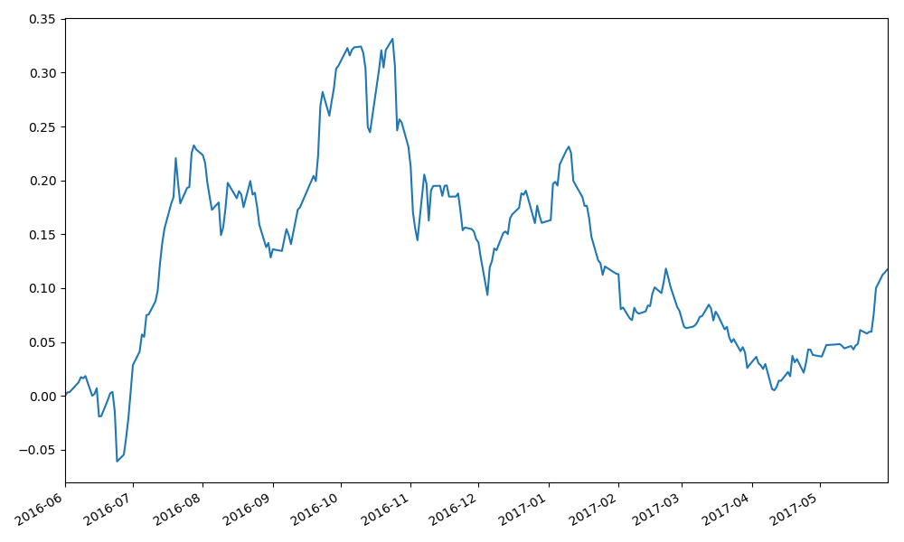
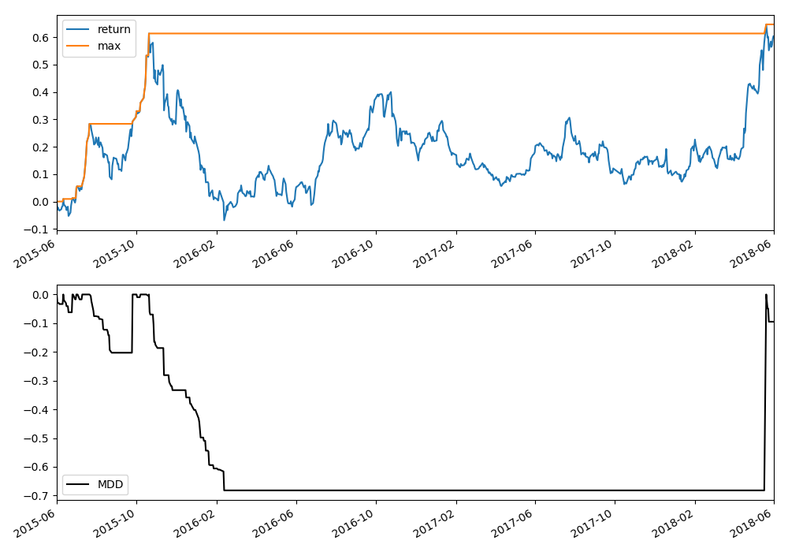
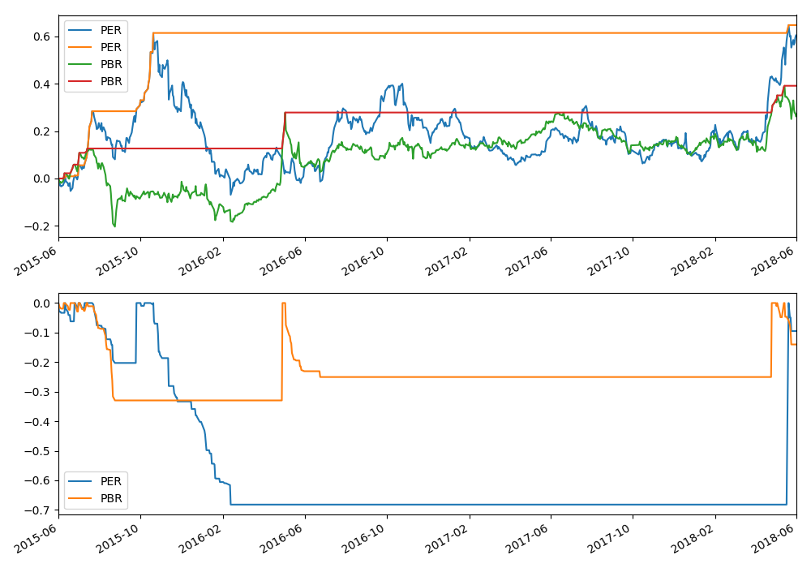

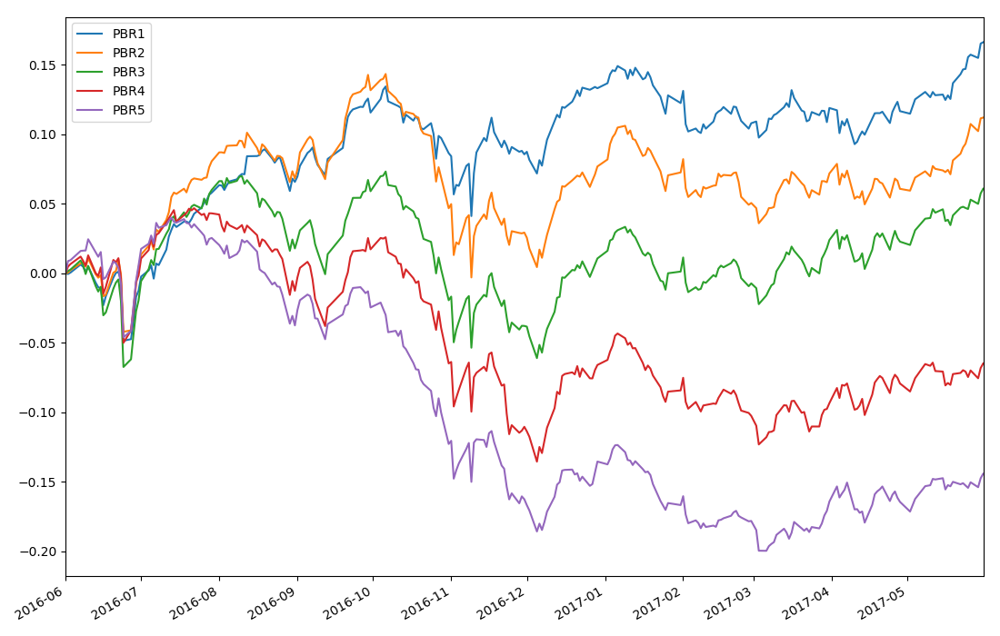
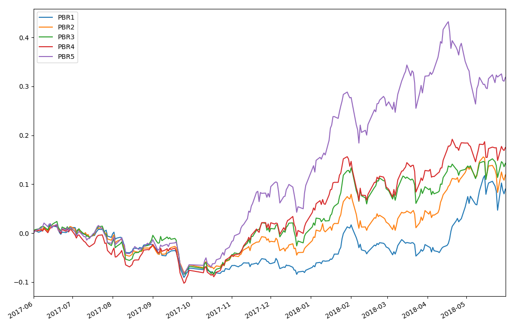
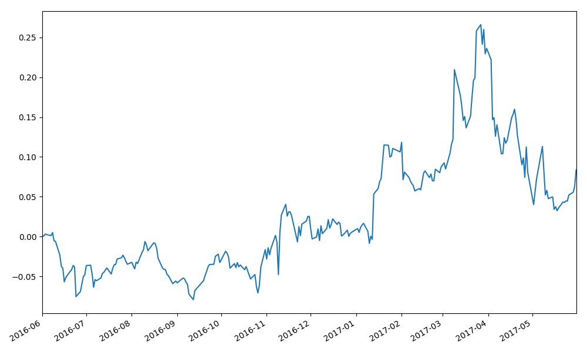
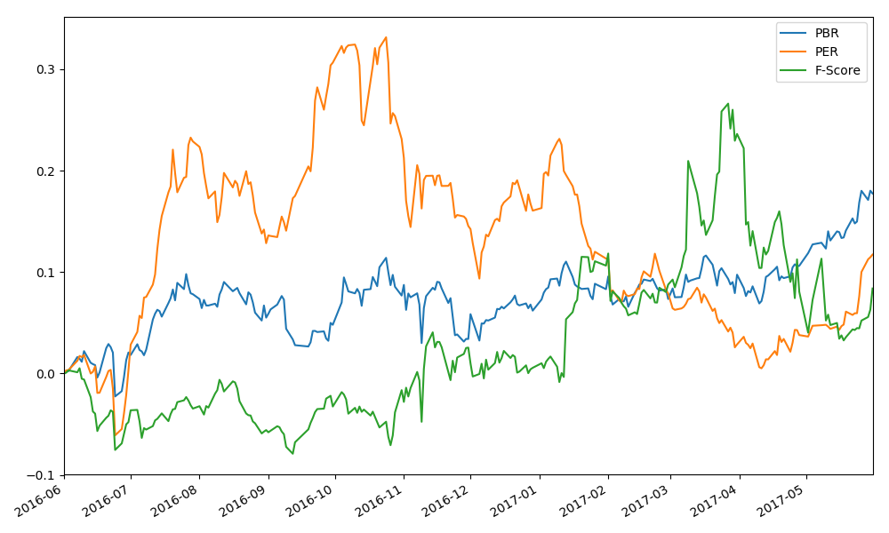

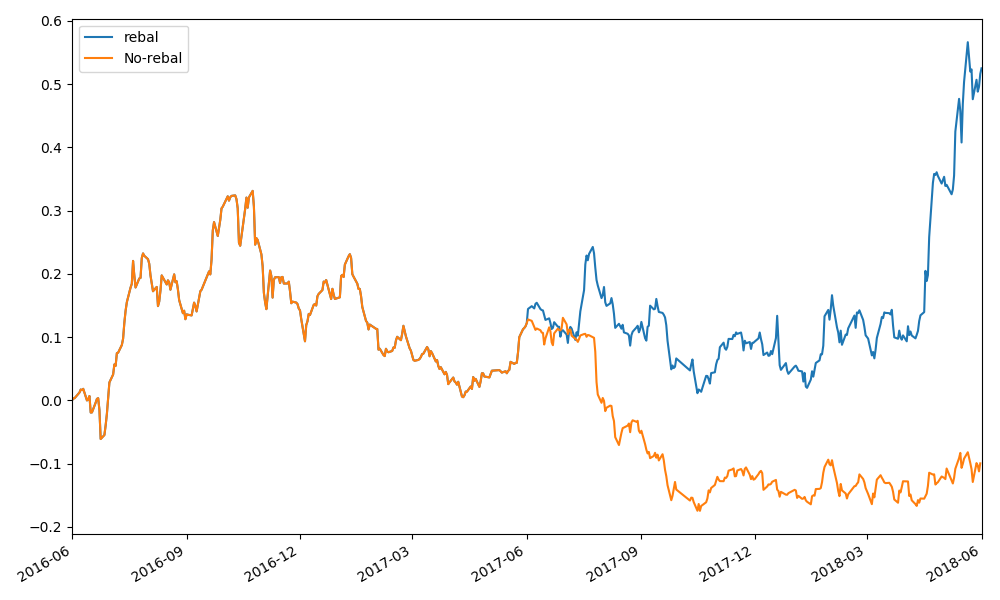
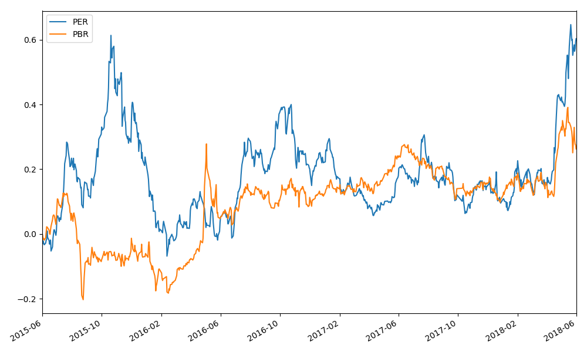
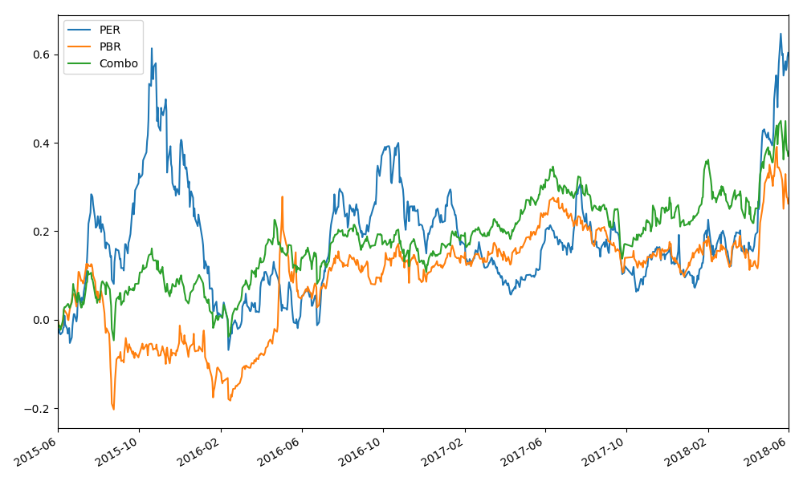
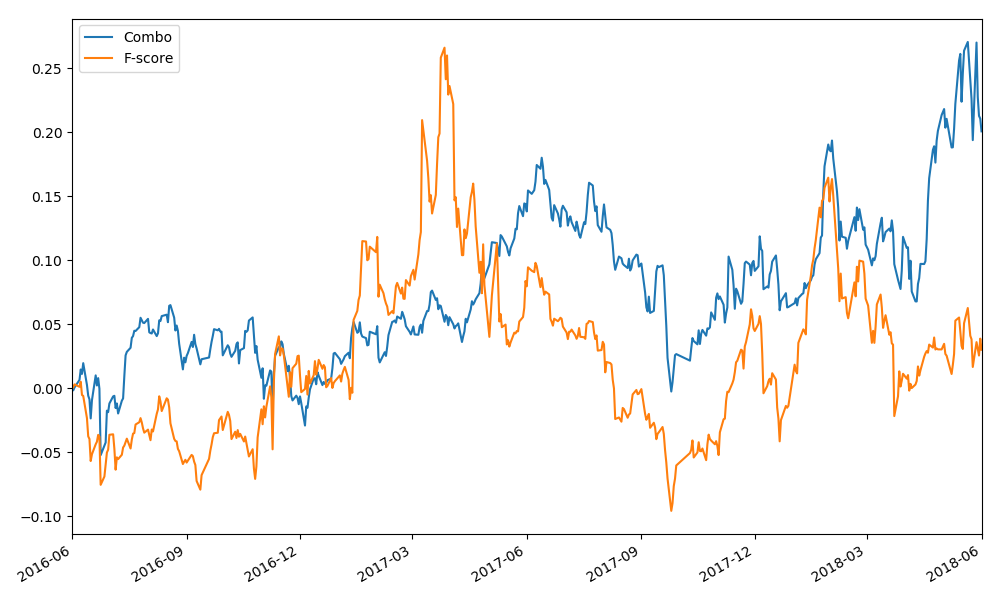
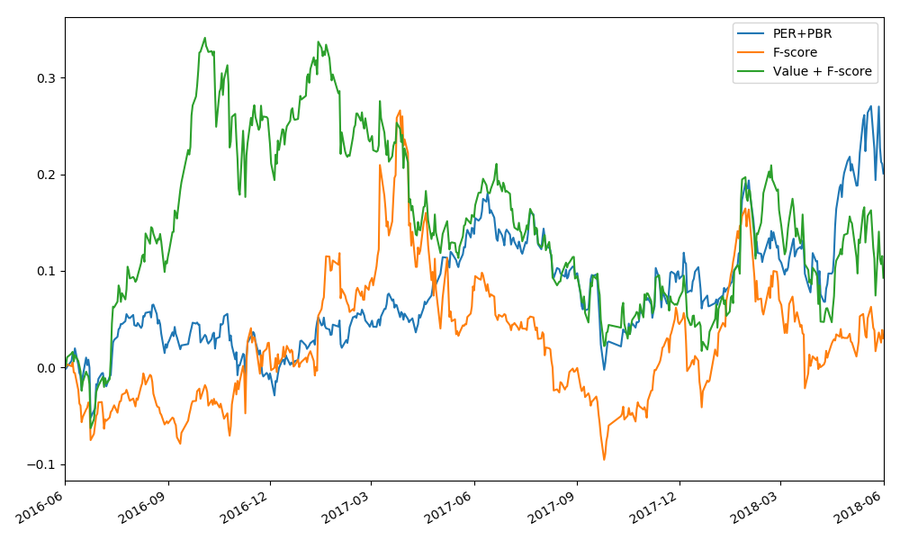
